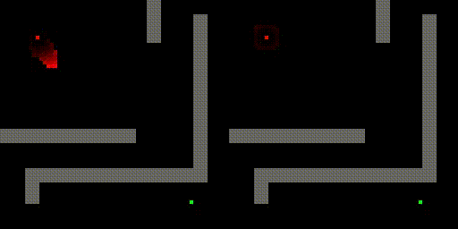

# Pathfinding algs

Basic pathfinding algorithms implementation (dijkstra & A-star) along with progress animations.

Works on a 2D grid with 8-directional movement.


```
usage: run.py [-h] [--alg {dijkstra,astar}] [--mod MOD] [--bench] [--reps REPS] [--no_anim] [-s STEP] [-l LAYOUT] [-e]

options:
-h, --help            show this help message and exit
--alg {dijkstra,astar}
--mod MOD             Modification param for individual algorithms.
--bench               Run timing benchmark (disables animation).
--reps REPS           Timing bench repetition count.
--no_anim             Disabled animations.
-s STEP, --step STEP  Animation step (render every Nth frame) - defines animation speed.
-l LAYOUT, --layout LAYOUT
                      Path to a layout file
-e, --early_out       Don't compute for all the tiles, only work until the destination is reached.
```

## Requirements:
* python-opencv
* numpy

## Sample:

<div style='text-align: center;'>
    
</div>